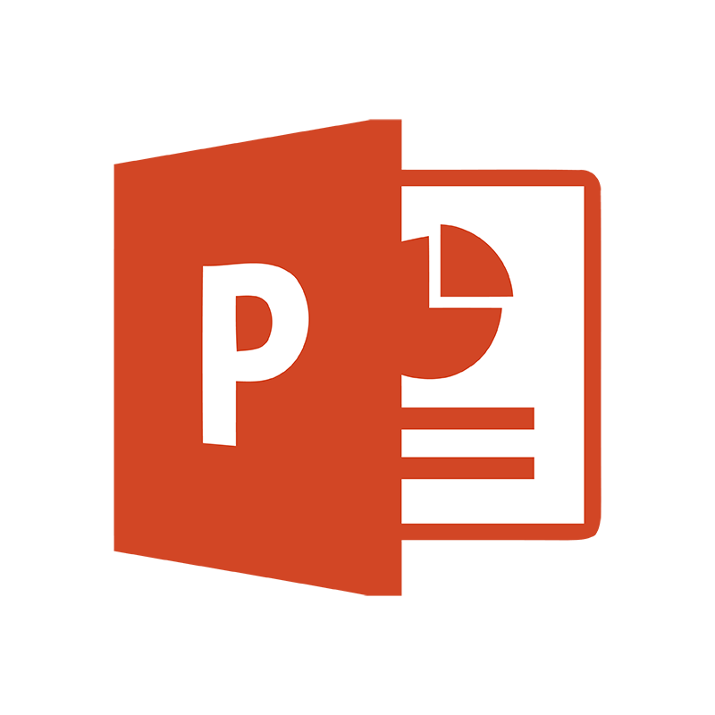

<b>Capstone Project 2 - Chillout Takeout Meal Delivery Company</b> 
 Presentation Slides: <a><a href="/Projects/Nicholas Yang Jun Hao - Capstone Project 2 - Chill out takeout.pdf" target="_blank">Chillout Takeout Meal Delivery Company</a> 

  

**Project description:**  
This project's objective is to analyse the outcome of the promotion and discontinue product with the least sale to minimise cost. This project was done in Microsoft's excel interactive dashboard with the data clean and prepare by using Microsoft SQL Server Management Studio.

### Outlook of the interactive dashboard

### Conclusion

With the help of this project, it allows me to understand the process of data preparation and the business objective. Withe the different slicers in place, the dashboard became interactive and allow user to drill down and analyse the specific data which gives a better picture to the targeted audience.

<b>
Please download the complete presentation slides at the top of the page to see the complete presentation slides.
  As the project file size is too big to be uploaded into Github, I have breakdown the project file into smaller segment for your reference above.
</b>

<a href="javascript:history.back()"><b>< Back</b></a>
