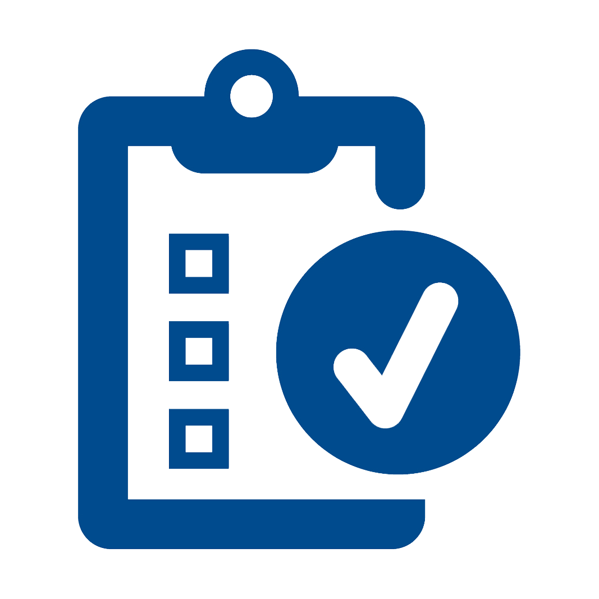

<b>Capstone Project 3 - Nicholas Reference Insurance Company(NRIC)</b> 

 Project:
<a><a href="/Projects/Nicholas Capstone 3 Project.pbix" target="_blank">Nicholas Reference Insurance Company(NRIC)</a> 

  

**Project description:**  
This project focus on the insurance market in the U.S.A, where we use past market data to assist users for a better informed purchasing decision. This time round we are using Power BI for this project.

### Overview of the U.S.A Insurance Market
After the cover page and introduction page, you will be looking this overview dashboard. It shows the overview numbers such as the top 3 benefits, the different insurance provider, consumers by states and many more. It gives insight to users of this dashboard to understand the current market direction and insurance benefits to focus on.

<a>

<a>
  
<a>
  
<a>

### Conclusion

With the help of this project, it allows me to understand the process of data preparation and the business objective. Withe the different slicers in place, the dashboard became interactive and allow user to drill down and analyse the specific data which gives a better picture to the targeted audience.

<b>
Please download the project at the top of the page to see more details.
</b>
<a href="javascript:history.back()"><b>< Back</b></a>
